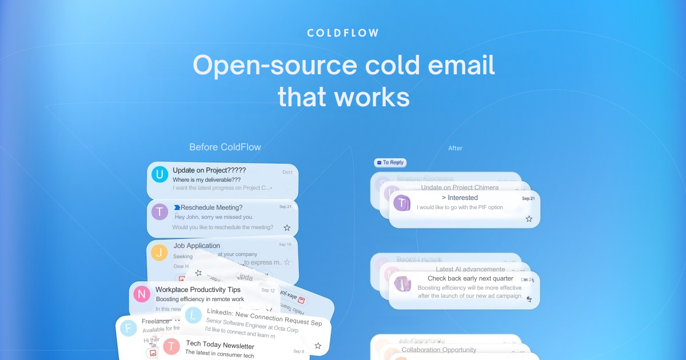

# Goal: Make all aspects of cold outbound functional, transparent, and accessible

- infra/domain setup
- list creation
- enrichment
- research
- ai personalization
- sequencing

# MVP features:

- enter a domain and see SPF / dkim / dmarc records
- connect google smtp accounts
- upload a csv of contacts
- Create a single-step email sequence with basic personalization ({first_name}).
- Send the emails (with a strict, safe sending limit).
- See a basic dashboard showing "sent" and "replied."

# Move the needle TO-DO list:

- [ ] Templates for popular email needs i.e "onboarding for SaaS"
- [ ] Integration with GHL / N8N

# Content TO-DO list:

- [ ] "How to Achieve Perfect Cold Email Deliverability with a Self-Hosted Tool"

- [ ] "The Complete Guide to Building a Custom Lead Scoring Model with Coldflow"

- [ ] "Why Your Shared IP is Killing Your Campaigns (And How to Take Back
      Control)"

- [ ] Listicles - Top 10 lists. I actually tested different platforms, used real
      screenshots and update them frequently.

- [ ] Guest posts - Find tech-related/ B2B / SaaS websites and pitch them
      content. Make sure there's context. For ex. one of my posts is on a
      Woocommerce site, so my article is how X can help grow your ecommerce
      store.

- [ ] Existing listicles - If you search for "Best X", there are dozens of
      articles already ranking in Google. Reach out to them and ask to be
      featured. Some will ignore you, some will ask you to pay, but eventually -
      some will say yes. I've ended up on 10+ existing sites.

- [ ] Original research - Launch a Startup report get it picked up by some big
      media outlets. I try to link to the research 2-3 times in either my own
      content or in guest articles.

- [ ] I use a variation of the anchor "According to research by X Tool". This is
      the strongest way to build authority.

- [ ] Keep content fresh. Never more than 6 months old. Each month, I updated
      content that is close to being more 6 months+ and rewrite the intro and
      include 1-2 internal links to new content.

# Ideas:

The real trouble starts only after the prospect replies. this is the part that
every tool completely ignores. and this is the part that matters the most.

When someone has already replied... they’re warm. they’ve shown interest. they
asked a question. they said yes send details. they requested pricing. whatever
it is. and then sometimes they go silent for 3 or 4 days. sometimes even 7. this
is where the follow up actually decides the deal. these are the follow ups that
convert. not the cold ones.
